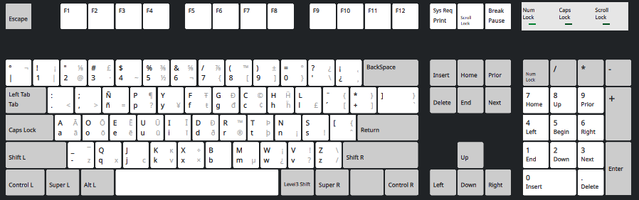

# Teclado Dvorak Latinoamericano para Programadores

## Descripción
Este proyecto modifica el layout de teclado Dvorak latinoamericano estándar para optimizarlo específicamente para programadores. Los cambios se centran en mejorar el acceso a símbolos frecuentemente utilizados en programación, eliminando teclas muertas de poco uso y reorganizando símbolos para mayor eficiencia.



## Filosofía del Proyecto
- **Mantener la disposición base de Dvorak**: Las teclas principales permanecen intactas
- **Optimizar el Level 3 (AltGr)**: Reemplazar símbolos poco utilizados por otros más relevantes para programación
- **Mejorar la memoria dactilar**: Ubicar símbolos importantes cerca de atajos de teclado comunes (Ctrl+C, Ctrl+V, etc.)
- **Eliminar teclas muertas innecesarias**: Sustituir dead keys por símbolos directamente accesibles

## Cambios Implementados

### Layout Básico (basic)
- **Símbolos básicos optimizados**: Mantenimiento de la funcionalidad esencial sin teclas muertas

### Layout Dvorak - Optimizaciones Level 3 (AltGr)

| Tecla | Símbolo Base | Level 3 Modificado | Justificación |
|-------|-------------|------------------|-------------------|
| ñ | ñ, Ñ | `=` | Facilita escritura de `<=` `>=` (cerca de `<>`) |
| p | p, P | `?` | Acceso rápido al símbolo `?` (más útil que `¶`) |
| - | -, _ | `z` | Memoria dactilar Ctrl+Z |
| q | q, Q | `x` | Memoria dactilar Ctrl+X |
| j | j, J | `c` | Memoria dactilar Ctrl+C |
| k | k, K | `v` | Memoria dactilar Ctrl+V |
| w | w, W | `¿, ¡` | Acceso directo a símbolos de apertura interrogación/exclamación |
| v | v, V | `?, !` | Símbolos de cerradura interrogación/exclamación |
| z | z, Z | `/, \` | Barras frecuentes en programación |

### Símbolos Optimizados para Programación

#### Símbolos Críticos Incluidos
- **Llaves**: `{}` - Definición de bloques de código
- **Corchetes**: `[]` - Acceso a arrays y estructuras de datos
- **Paréntesis**: `()` - Funciones y agrupación
- **Operadores**: `=`, `==`, `!=`, `<`, `>`, `<=`, `>=`
- **Operadores matemáticos**: `+`, `-`, `*`, `/`, `%`
- **Barras**: `/`, `\` - Comentarios y rutas de archivos
- **Símbolos especiales**: `#`, `$`, `@`, `~`, `^`, `|`

#### Acceso Mejorado a Atajos
- **Ctrl+C/V/X/Z**: Símbolos ubicados estratégicamente cerca de estos atajos
- **Navegación**: Símbolos de comparación y asignación fácilmente accesibles
- **Comentarios**: Acceso rápido a `#`, `//` y símbolos relacionados

## Instalación

1. **Backup del archivo original**:
   ```bash
   sudo cp /usr/share/X11/xkb/symbols/latam /usr/share/X11/xkb/symbols/latam.backup
   ```

2. **Aplicar la configuración modificada**:
   ```bash
   sudo cp latam /usr/share/X11/xkb/symbols/latam
   ```

3. **Reiniciar el sistema**:
	También es posible cerrar sesión e iniciar de nuevo o forzar el reconocimiento del teclado cambiando el layout manualmente.


## Contribuciones
Se aceptan sugerencias y mejoras. Para contribuir:
1. Fork del repositorio
2. Crear rama feature
3. Realizar cambios
4. Enviar pull request

## Licencia
Este proyecto mantiene la licencia original del layout XKB latinoamericano.

## Créditos
- **Autor original**: Fabian Mandelbaum
- **Modificaciones**: fcamachos
- **Basado en**: Layout Dvorak latinoamericano estándar
